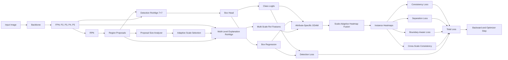
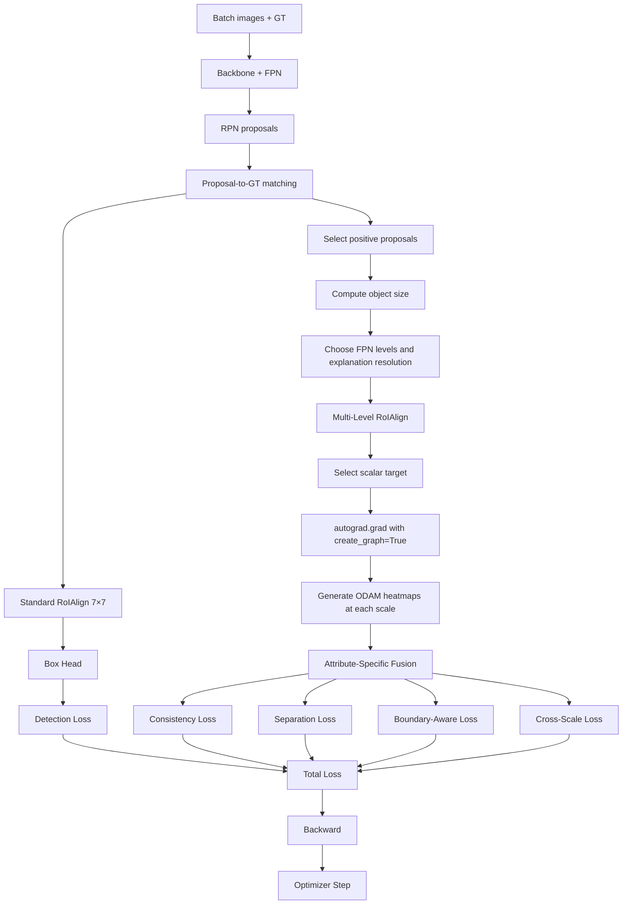

# Kiến trúc cải tiến ODAM cho Faster R-CNN

## 1. Tên đề xuất

**SAB-ODAM: Scale-Adaptive and Boundary-Aware ODAM for Small Object Detection**

Tên thay thế:

> **Beyond 7×7: Scale-Adaptive ODAM Training for Explainable Small-Object Detection in Faster R-CNN**

---

## 2. Mục tiêu nghiên cứu

Phương pháp được xây dựng từ nhược điểm của ODAM/Odam-Train khi áp dụng trên Faster R-CNN:

- ODAM sử dụng RoI feature có độ phân giải cố định, thường là `7×7`.
- Heatmap `7×7` có thể quá thô đối với vật thể nhỏ hoặc lỗi bề mặt nhỏ.
- Chỉ tăng kích thước RoIAlign lên `14×14` hoặc `28×28` chưa chắc tạo thêm thông tin mới nếu feature nguồn đã thiếu chi tiết.
- Odam-Train gốc chỉ tối ưu consistency và separation giữa các heatmap, nhưng chưa hướng dẫn heatmap của từng thuộc tính bounding box tập trung đúng vào vùng biên tương ứng.
- Các scale FPN khác nhau chứa thông tin khác nhau: tầng nông giữ chi tiết không gian, còn tầng sâu giữ thông tin ngữ nghĩa mạnh hơn.

### Câu hỏi nghiên cứu trung tâm

> Liệu biểu diễn RoI có độ phân giải cố định trong ODAM có tạo ra một nút thắt explanation đối với small object, và một cơ chế ODAM đa tỉ lệ thích nghi theo kích thước object có thể cải thiện chất lượng giải thích cũng như khả năng phát hiện vật thể nhỏ hay không?

---

## 3. Giả thuyết nghiên cứu

### H1 — Explanation resolution bottleneck

Khi kích thước object giảm, chất lượng explanation của ODAM `7×7` sẽ giảm nhanh hơn so với medium và large object.

### H2 — High-resolution source quan trọng hơn chỉ nội suy

Chỉ đổi:

```text
7×7 → 14×14 → 28×28
```

sẽ không hiệu quả bằng việc sử dụng feature có độ phân giải cao từ các FPN level như `P2` và `P3`.

### H3 — Mỗi detection attribute cần scale khác nhau

- Class score cần nhiều semantic information.
- Bounding-box coordinates cần spatial detail và thông tin biên.

Do đó:

```text
scale distribution cho class
≠
scale distribution cho x1, y1, x2, y2
```

### H4 — Explanation-guided training có thể hỗ trợ small-object detection

Nếu explanation của small object được định vị đúng hơn, đặc biệt tại các vùng biên, mô hình có thể cải thiện:

- AP small;
- AP75;
- localization accuracy;
- crowded recall;
- explanation localization.

---

# 4. Kiến trúc tổng thể

## 4.1. Nguyên tắc thiết kế

Phương pháp giữ nguyên nhánh detection chuẩn của Faster R-CNN để bảo đảm:

- baseline công bằng;
- không làm thay đổi detection head chính;
- improvement không đơn giản đến từ việc tăng kích thước mạng;
- có thể loại bỏ explanation branch khi inference thông thường.

Kiến trúc gồm hai nhánh:

1. **Detection branch** — Faster R-CNN gốc.
2. **Scale-Adaptive Explanation branch** — nhánh ODAM đa tỉ lệ chỉ dùng khi cần giải thích hoặc trong Odam-Train.

---

## 4.2. Sơ đồ kiến trúc



---

# 5. Nhánh Detection giữ nguyên

Nhánh detection sử dụng Faster R-CNN chuẩn:

```text
Image
  ↓
Backbone + FPN
  ↓
RPN
  ↓
Region Proposals
  ↓
RoIAlign 7×7
  ↓
Box Head
  ↓
Classification + Box Regression
```

Với proposal thứ `i`:

\[
A_i^{det} \in \mathbb{R}^{C\times7\times7}
\]

Nhánh này sinh:

- class logits;
- box regression outputs;
- detection loss gốc.

\[
L_{det}
=
L_{rpn}^{cls}
+
L_{rpn}^{box}
+
L_{roi}^{cls}
+
L_{roi}^{box}
\]

---

# 6. Scale-Adaptive Explanation Branch

## 6.1. Phân tích kích thước proposal

Với proposal:

\[
B_i=(x_1,y_1,x_2,y_2)
\]

tính diện tích tương đối:

\[
a_i=
\frac{\operatorname{area}(B_i)}
{\operatorname{area}(I)}
\]

Từ đó chọn độ phân giải explanation:

\[
r_i=
\begin{cases}
28, & a_i<\tau_s \\
14, & \tau_s\le a_i<\tau_m \\
7, & a_i\ge\tau_m
\end{cases}
\]

| Kích thước object | Resolution explanation |
|---|---:|
| Small | `28×28` |
| Medium | `14×14` |
| Large | `7×7` |

---

## 6.2. Chọn FPN level thích nghi

Thay vì chỉ lấy feature từ một FPN level, explanation branch sử dụng nhiều level:

\[
\mathcal L_i=
\begin{cases}
\{P_2,P_3\}, & \text{small object}\\
\{P_2,P_3,P_4\}, & \text{medium object}\\
\{P_3,P_4,P_5\}, & \text{large object}
\end{cases}
\]

### Ý nghĩa của từng tầng

| FPN level | Vai trò chính |
|---|---|
| `P2` | Chi tiết không gian, cạnh, defect nhỏ |
| `P3` | Cân bằng giữa chi tiết và ngữ nghĩa |
| `P4` | Hình dạng và thông tin semantic |
| `P5` | Context và ngữ nghĩa cấp cao |

---

## 6.3. Multi-level RoIAlign

Với từng FPN level `l`:

\[
A_{i,l}
=
\operatorname{RoIAlign}
(P_l,B_i,r_{i,l})
\]

Ví dụ với small object:

\[
A_{i,2}
=
\operatorname{RoIAlign}(P_2,B_i,28)
\]

\[
A_{i,3}
=
\operatorname{RoIAlign}(P_3,B_i,14)
\]

Sau đó resize về cùng kích thước:

\[
\widetilde A_{i,l}
=
\operatorname{Resize}(A_{i,l},r_i,r_i)
\]

> Độ phân giải output cao phải đi cùng feature nguồn có độ phân giải cao. Chỉ nội suy một RoI feature nghèo thông tin không tạo ra explanation chi tiết thật sự.

---

# 7. Attribute-Specific Multi-Scale ODAM

## 7.1. Scalar target

Với mỗi positive proposal, phương pháp tạo explanation cho:

\[
Y_i^a
\]

trong đó:

\[
a\in
\{
cls,x_1,y_1,x_2,y_2
\}
\]

Các scalar target gồm:

- class logit của class GT;
- regression output cho cạnh trái;
- regression output cho cạnh trên;
- regression output cho cạnh phải;
- regression output cho cạnh dưới.

---

## 7.2. Gradient tại từng scale

Tại FPN level `l`:

\[
G_{i,l}^{a}
=
\frac{\partial Y_i^{a}}
{\partial A_{i,l}}
\]

Áp dụng local smoothing:

\[
W_{i,l}^{a}
=
\Phi_l
\left(
G_{i,l}^{a}
\right)
\]

Heatmap ODAM tại scale `l`:

\[
H_{i,l}^{a}
=
\operatorname{ReLU}
\left(
\sum_c
W_{i,l,c}^{a}
\odot
A_{i,l,c}
\right)
\]

---

## 7.3. Attribute-specific scale weighting

Mỗi attribute có một tập trọng số scale riêng:

\[
\alpha_{i,l}^{a}
=
\operatorname{softmax}
\left(
f_\theta
[
\operatorname{area}(B_i),
\operatorname{aspect}(B_i),
s_i,
a,
l
]
\right)
\]

Heatmap đa tỉ lệ cuối cùng:

\[
\boxed{
H_i^{a}
=
\sum_{l\in\mathcal L_i}
\alpha_{i,l}^{a}
\operatorname{Resize}
\left(
H_{i,l}^{a},
r_i,r_i
\right)
}
\]

### Kỳ vọng

Đối với classification, các tầng `P3/P4` có thể được ưu tiên vì chứa semantic information mạnh hơn.

Đối với bounding-box coordinates, các tầng `P2/P3` có thể được ưu tiên vì giữ chi tiết biên tốt hơn.

---

# 8. Boundary-Aware Explanation Supervision

## 8.1. Lý do

Odam-Train gốc chỉ yêu cầu:

- cùng GT có heatmap giống nhau;
- khác GT có heatmap khác nhau.

Nó chưa hướng dẫn:

- heatmap `x1` tập trung ở cạnh trái;
- heatmap `x2` tập trung ở cạnh phải;
- heatmap `y1` tập trung ở cạnh trên;
- heatmap `y2` tập trung ở cạnh dưới.

---

## 8.2. Tạo boundary bands từ bounding box

Với GT box:

\[
B=(x_1,y_1,x_2,y_2)
\]

tạo bốn mask:

\[
M^{left},\quad
M^{top},\quad
M^{right},\quad
M^{bottom}
\]

Ví dụ mask cạnh trái:

\[
M^{left}(x,y)
=
\mathbf 1
\left[
|x-x_1|<\epsilon w,
\quad
y_1\le y\le y_2
\right]
\]

trong đó:

\[
w=x_2-x_1
\]

Tương tự cho ba cạnh còn lại.

---

## 8.3. Boundary loss

Với heatmap cạnh trái:

\[
L_{edge}^{x_1}
=
1-
\frac{
\sum H^{x_1}\odot M^{left}
}{
\sum H^{x_1}+\epsilon
}
\]

Tương tự:

\[
L_{edge}^{y_1},
\quad
L_{edge}^{x_2},
\quad
L_{edge}^{y_2}
\]

Tổng boundary loss:

\[
L_{edge}
=
L_{edge}^{x_1}
+
L_{edge}^{y_1}
+
L_{edge}^{x_2}
+
L_{edge}^{y_2}
\]

---

## 8.4. Class-inside-object loss

Class heatmap được khuyến khích tập trung trong vùng object:

\[
L_{inside}^{cls}
=
1-
\frac{
\sum H^{cls}\odot M^{box}
}{
\sum H^{cls}+\epsilon
}
\]

Trong đó `Mbox` là mask của toàn bộ bounding box GT.

---

# 9. Odam-Train đa tỉ lệ

## 9.1. Consistency loss

Các positive proposal cùng GT object phải tạo heatmap tương tự:

\[
L_{con}^{MR}
=
\sum_g
\sum_{i\in\mathcal P_g}
\left[
1-
\cos
\left(
H_i^{MR},
H_g^{ref}
\right)
\right]
\]

---

## 9.2. Separation loss

Các proposal thuộc GT object khác nhau phải tạo heatmap khác nhau:

\[
L_{sep}^{MR}
=
\sum_{g_i\neq g_j}
\max
\left(
0,
\cos
\left(
H_i^{MR},
H_j^{MR}
\right)
-
m
\right)
\]

Có thể chỉ sử dụng hard pairs:

- cùng class;
- box overlap cao;
- heatmap correlation cao;
- object nhỏ hoặc bị occlusion.

---

# 10. Cross-Scale Explanation Consistency

Sau khi resize heatmap từ từng FPN level:

\[
\widetilde H_{i,l}^{a}
=
\operatorname{Resize}
\left(
H_{i,l}^{a},
r_i,r_i
\right)
\]

loss được định nghĩa:

\[
L_{scale}
=
\sum_i
\sum_a
\sum_{l\in\mathcal L_i}
\alpha_{i,l}^{a}
\left[
1-
\cos
\left(
\widetilde H_{i,l}^{a},
H_i^{a}
\right)
\right]
\]

Scale có trọng số thấp sẽ không bị ép quá mạnh.

---

# 11. Tổng hàm mất mát

\[
\boxed{
L=
L_{det}
+
\lambda_{con}L_{con}^{MR}
+
\lambda_{sep}L_{sep}^{MR}
+
\lambda_{scale}L_{scale}
+
\lambda_{edge}L_{edge}
+
\lambda_{inside}L_{inside}^{cls}
}
\]

| Thành phần | Mục đích |
|---|---|
| `Ldet` | Detection loss Faster R-CNN |
| `Lcon` | Consistency giữa proposal cùng object |
| `Lsep` | Tách heatmap của các object khác nhau |
| `Lscale` | Giữ explanation nhất quán giữa các FPN level |
| `Ledge` | Hướng dẫn bbox-coordinate heatmap về đúng cạnh |
| `Linside` | Giữ class heatmap trong vùng object |

---

# 12. Small-object-aware weighting

Có thể tăng trọng số cho object nhỏ:

\[
w_i
=
\left(
\frac{a_{ref}}
{a_i+\epsilon}
\right)^\gamma
\]

Sau đó clip:

\[
w_i
=
\min(w_i,w_{max})
\]

Loss theo instance:

\[
L_i^{small}
=
w_i
\left(
L_{con,i}
+
L_{sep,i}
+
L_{edge,i}
+
L_{scale,i}
\right)
\]

Mục tiêu:

- object nhỏ nhận supervision mạnh hơn;
- tránh để large object chi phối toàn bộ Odam loss;
- vẫn giới hạn gradient để tránh mất ổn định.

---

# 13. Luồng huấn luyện



---

# 14. Luồng inference

## 14.1. Inference detection thông thường

```text
Input
  ↓
Faster R-CNN
  ↓
Boxes + Scores + Labels
```

Explanation branch có thể được bỏ qua.

## 14.2. Inference có explanation

```text
Input
  ↓
Faster R-CNN
  ↓
Chọn prediction
  ↓
Scale-Adaptive Explanation Branch
  ↓
Class heatmap + x1/y1/x2/y2 heatmaps
```

Nhánh cải tiến không bắt buộc làm tăng chi phí inference thông thường.

---

# 15. Tối ưu chi phí tính toán

Để giới hạn VRAM và thời gian huấn luyện:

1. Chỉ dùng positive proposals.
2. Giới hạn top-`K` proposals cho mỗi GT.
3. Chỉ bật high-resolution branch cho small object.
4. Warm-up detector trước khi kích hoạt Odam-Train.
5. Chạy Odam loss mỗi `k` iteration thay vì mọi iteration.
6. Sử dụng gradient checkpointing.
7. Tính nhánh ODAM bằng FP32 nếu AMP gây mất ổn định.
8. Loại bỏ easy pairs khỏi separation loss.
9. Giới hạn số FPN level theo kích thước proposal.

Ví dụ:

```text
Large object
  → 1 level, 7×7

Medium object
  → 2–3 levels, 14×14

Small object
  → P2 + P3, 28×28
```

---

# 16. Đóng góp khoa học dự kiến

## Đóng góp 1 — Phân tích explanation resolution bottleneck

Định lượng sự suy giảm chất lượng explanation theo kích thước object khi ODAM sử dụng RoI feature cố định `7×7`.

## Đóng góp 2 — Scale-adaptive multi-level ODAM

Một explanation branch lựa chọn FPN level, RoI resolution và scale weight theo từng object instance.

## Đóng góp 3 — Attribute-specific scale fusion

Class score và từng bounding-box coordinate sử dụng phân phối scale riêng.

## Đóng góp 4 — Boundary-aware Odam-Train

Dùng bounding-box annotation để hướng dẫn heatmap của từng regression attribute về đúng cạnh tương ứng.

## Đóng góp 5 — Training-only explanation branch

Cải thiện explanation learning mà không bắt buộc tăng chi phí inference của Faster R-CNN chuẩn.

---

# 17. Thiết kế thực nghiệm

## 17.1. Baseline

| Phương pháp | Vai trò |
|---|---|
| Faster R-CNN | Detection baseline |
| Faster R-CNN + ODAM | Explanation baseline |
| Faster R-CNN + Odam-Train | Training baseline |
| ODAM fixed `14×14` | Resolution ablation |
| ODAM fixed `28×28` | Interpolation ablation |
| ODAM `P2` only | High-resolution source ablation |
| Multi-level ODAM | Multi-scale ablation |
| Scale-adaptive ODAM | Adaptive resolution ablation |
| + Attribute-specific fusion | Attribute ablation |
| + Boundary-aware loss | Full model |

## 17.2. Dataset

- **MS COCO** — benchmark tổng quát và AP small.
- **CrowdHuman** — crowded scene và object discrimination.
- **TinyPerson hoặc small-object dataset công khai** — tiny-object evaluation.
- **Drill-bit dataset** — industrial case study.

## 17.3. Detection metrics

- mAP;
- AP50;
- AP75;
- AP small;
- AP medium;
- AP large;
- recall;
- crowded recall;
- localization error.

## 17.4. Explanation metrics

### Localization

- Pointing Game;
- Energy-based Pointing Game;
- Heatmap compactness;
- ODI;
- class heatmap energy inside box;
- boundary energy cho `x1`, `y1`, `x2`, `y2`.

### Faithfulness

- Deletion;
- Insertion;
- feature masking score drop;
- sufficiency;
- comprehensiveness.

### Stability

- consistency qua flip;
- resize;
- crop;
- color perturbation;
- checkpoint stability.

### Efficiency

- training time/epoch;
- explanation time/proposal;
- peak VRAM;
- số proposal được sử dụng;
- chi phí theo object size.

---

# 18. Phân tích theo kích thước object

Không chỉ báo cáo kết quả trung bình.

Chia object thành các nhóm:

```text
< 8 px
8–16 px
16–32 px
32–64 px
> 64 px
```

Hoặc theo diện tích:

\[
[0,8^2),\quad
[8^2,16^2),\quad
[16^2,32^2),\quad
[32^2,96^2),\quad
[96^2,\infty)
\]

Với mỗi nhóm, báo cáo:

- AP;
- recall;
- Pointing Game;
- energy inside box;
- boundary energy;
- compactness;
- deletion/insertion.

Figure trung tâm kỳ vọng:

```text
Object càng nhỏ
    ↓
ODAM 7×7 giảm mạnh
    ↓
Fixed 28×28 cải thiện ít
    ↓
Multi-level adaptive ODAM cải thiện rõ
```

---

# 19. Ablation bắt buộc

1. `7×7` vs `14×14` vs `28×28`.
2. Một FPN level vs nhiều FPN level.
3. Fixed fusion vs learned fusion.
4. Shared scale weights vs attribute-specific weights.
5. Không boundary loss vs có boundary loss.
6. Không cross-scale loss vs có cross-scale loss.
7. Tất cả proposals vs top-`K`.
8. Odam loss từ epoch đầu vs warm-up.
9. Tất cả object sizes vs small-object-only.
10. Gaussian smoothing cố định vs adaptive smoothing.

---

# 20. Rủi ro nghiên cứu

## 20.1. Heatmap sắc nét hơn nhưng không faithful hơn

Cần bắt buộc đánh giá bằng insertion, deletion, feature masking và sanity randomization.

## 20.2. AP small không cải thiện

Khi đó phương pháp vẫn có thể đóng góp cho XAI, nhưng không nên tuyên bố cải thiện detection nếu không có bằng chứng.

## 20.3. P2 gây nhiễu

Feature nông có thể nhạy với texture và background. Do đó cần adaptive fusion thay vì luôn ưu tiên P2.

## 20.4. Chi phí gradient bậc hai

`create_graph=True` với nhiều FPN level và heatmap độ phân giải cao có thể rất tốn VRAM.

## 20.5. Boundary supervision có thể quá cứng

Một số object có biên mờ hoặc bị che khuất. Boundary mask nên là soft band thay vì binary line quá hẹp.

## 20.6. Scale fusion có thể collapse

Mô hình có thể luôn chọn một FPN level. Cần theo dõi entropy của scale weights hoặc thêm regularization nhẹ.

---

# 21. Lộ trình triển khai

## Giai đoạn A — Xác minh hiện tượng

1. Huấn luyện Faster R-CNN baseline.
2. Tích hợp ODAM gốc trên RoI feature `7×7`.
3. Đánh giá explanation theo kích thước object.
4. Xác nhận có hay không resolution bottleneck.

## Giai đoạn B — Resolution ablation

1. ODAM `7×7`.
2. ODAM `14×14`.
3. ODAM `28×28`.
4. P2-only ODAM.
5. P3-only ODAM.
6. P2 + P3 fusion.

## Giai đoạn C — Scale-adaptive ODAM

1. Proposal size analyzer.
2. Adaptive RoI resolution.
3. Multi-level RoIAlign.
4. Learned scale fusion.

## Giai đoạn D — Attribute-specific fusion

1. Scale weights riêng cho class.
2. Scale weights riêng cho box regression.
3. Phân tích learned scale distribution.

## Giai đoạn E — Boundary-aware Odam-Train

1. Tạo boundary masks.
2. Thêm edge losses.
3. Thêm consistency và separation đa tỉ lệ.
4. Calibrate các hệ số loss.

## Giai đoạn F — Thực nghiệm đầy đủ

1. Nhiều dataset.
2. Tối thiểu ba random seeds.
3. Ablation đầy đủ.
4. Efficiency analysis.
5. Statistical significance.

---

# 22. Tóm tắt kiến trúc bằng một luồng ngắn

```text
Faster R-CNN chuẩn
    │
    ├── Detection branch
    │      └── RoIAlign 7×7 → Box Head → Detection Loss
    │
    └── Explanation branch
           ├── Phân tích kích thước proposal
           ├── Chọn FPN level
           ├── Chọn resolution 7/14/28
           ├── Tạo ODAM tại từng scale
           ├── Fusion riêng cho class và bbox attributes
           ├── Consistency giữa proposal cùng GT
           ├── Separation giữa object khác GT
           ├── Boundary-aware supervision
           └── Cross-scale consistency
                    │
                    ▼
        Detection Loss + Explanation Loss
                    │
                    ▼
          Backward qua toàn bộ detector
```

---

# 23. Kết luận

Kiến trúc cải tiến không chỉ thay RoIAlign `7×7` bằng độ phân giải lớn hơn.

Đề xuất cốt lõi là:

> **Giữ nguyên Faster R-CNN detection branch, bổ sung một explanation branch đa tỉ lệ thích nghi theo kích thước object, chọn scale riêng cho từng detection attribute, và dùng boundary-aware Odam-Train để cải thiện explanation cho small object.**

Công thức đóng góp tổng quát:

\[
\boxed{
\text{Fixed-resolution ODAM}
\rightarrow
\text{Scale-adaptive multi-level ODAM}
\rightarrow
\text{Attribute-specific fusion}
\rightarrow
\text{Boundary-aware Odam-Train}
}
\]

Đây là hướng đủ rõ để phát triển thành một bài nghiên cứu, với điều kiện bước đầu tiên phải chứng minh được rằng **RoI explanation resolution bottleneck thực sự tồn tại**.

---

## Tài liệu nền tảng

- Zhao, C. & Chan, A. B.  
  **ODAM: Gradient-based Instance-specific Visual Explanations for Object Detection.**  
  ICLR 2023, arXiv:2304.06354.
