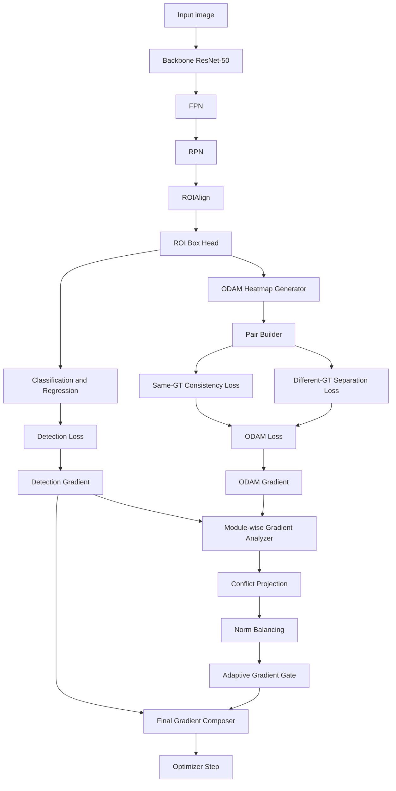

# Gradient-Aligned ODAM
## Kiến trúc ODAM ưu tiên nhiệm vụ phát hiện và điều chỉnh xung đột gradient

**Tên đề xuất:** Detection-Priority Gradient-Aligned ODAM  
**Tên viết tắt:** **DPGA-ODAM**  
**Detector mục tiêu:** Faster R-CNN R50-FPN  
**Benchmark chính:** CrowdHuman  
**Benchmark mở rộng:** MS COCO và bộ dữ liệu drill-bit  
**Trạng thái:** Thiết kế kiến trúc nghiên cứu

---

## 1. Bối cảnh

ODAM-Train bổ sung các ràng buộc explanation vào quá trình huấn luyện object detector. Ý tưởng cốt lõi là:

- Các prediction thuộc cùng một ground-truth object nên có explanation tương đồng.
- Các prediction thuộc các ground-truth object khác nhau nên có explanation khác biệt.
- Explanation tốt hơn có thể hỗ trợ phân biệt các instance bị chồng lấn và hỗ trợ ODAM-NMS.

Với Faster R-CNN, tổng loss của ODAM-Train có thể viết:

\[
L_{\text{total}}
=
L_{\text{det}}
+
\lambda_{\text{same}}L_{\text{same}}
+
\lambda_{\text{diff}}L_{\text{diff}}
\]

Trong đó:

- \(L_{\text{det}}\): loss phát hiện của Faster R-CNN.
- \(L_{\text{same}}\): consistency loss giữa các proposal thuộc cùng ground-truth.
- \(L_{\text{diff}}\): separation loss giữa các proposal thuộc các ground-truth khác nhau.
- \(\lambda_{\text{same}},\lambda_{\text{diff}}\): trọng số loss explanation.

Cách cộng loss trực tiếp có nhược điểm quan trọng: nó không bảo đảm gradient explanation hỗ trợ gradient detection.

Kết quả thực nghiệm hiện tại cho thấy:

- Chất lượng pair tương đối tốt.
- Empty-pair gate gần như không phải điểm nghẽn.
- Cosine similarity giữa gradient detection và gradient ODAM gần bằng 0.
- Gradient ODAM thực tế tham gia vào bước cập nhật trọng số rất nhỏ.
- Một số biến thể cải thiện so với ODAM gốc nhưng chưa khai thác hết tiềm năng của explanation supervision.

Điểm nghẽn vì vậy nằm ở **cách gradient ODAM tương tác với detector**, không chỉ ở cách tạo pair hay thay đổi trọng số loss.

---

## 2. Mục tiêu nghiên cứu

DPGA-ODAM được thiết kế để đạt bốn mục tiêu:

1. **Giữ detection là nhiệm vụ ưu tiên.**  
   Explanation loss không được phép làm suy giảm mạnh khả năng phát hiện.

2. **Chỉ sử dụng phần gradient ODAM an toàn.**  
   Phần gradient xung đột với detection được chiếu bỏ hoặc giảm trọng số.

3. **Điều chỉnh gradient theo từng module.**  
   Backbone, FPN, RPN và ROI head không nhận cùng một mức tác động ODAM.

4. **Thích nghi theo trạng thái huấn luyện.**  
   Mức đóng góp của ODAM được điều chỉnh dựa trên cosine similarity, gradient norm, độ tin cậy proposal và giai đoạn epoch.

---

## 3. Giả thuyết nghiên cứu

### H1 — Gradient interference

Việc cộng trực tiếp \(L_{\text{det}}\) và \(L_{\text{ODAM}}\) có thể tạo gradient gây nhiễu cho detector.

### H2 — Detection-priority projection

Nếu loại bỏ thành phần gradient ODAM ngược hướng với detection, hiệu năng phát hiện sẽ cao hơn ODAM-Train gốc.

### H3 — Module-wise behavior

Gradient ODAM có mức hữu ích khác nhau ở từng module:

- ROI shared head có thể hưởng lợi nhiều nhất.
- Backbone và FPN chỉ nên nhận gradient đã giới hạn.
- RPN và ROI box regressor cần được bảo vệ mạnh hơn.

### H4 — Adaptive contribution

Một cơ chế thích nghi theo cosine similarity và gradient norm sẽ ổn định hơn một hệ số \(\lambda\) cố định.

---

## 4. Tổng quan kiến trúc



Luồng cốt lõi:

```text
Detection loss ──> detection gradient ─────────────────────────┐
                                                               │
ODAM loss ───────> ODAM gradient                               │
                         │                                     │
                         ├─ module-wise cosine analysis         │
                         ├─ conflict projection                 │
                         ├─ norm balancing                      │
                         └─ adaptive gate ──> safe ODAM gradient│
                                                               ▼
                                                  final optimizer gradient
```

---

## 5. Faster R-CNN Detection Branch

Nhánh detection giữ nguyên cấu trúc Faster R-CNN:

\[
L_{\text{det}}
=
L_{\text{rpn-cls}}
+
L_{\text{rpn-reg}}
+
L_{\text{roi-cls}}
+
L_{\text{roi-reg}}
\]

Các thành phần:

- Backbone ResNet-50.
- Feature Pyramid Network.
- Region Proposal Network.
- ROIAlign.
- ROI shared box head.
- Classification head.
- Bounding-box regression head.

DPGA-ODAM không thay đổi detection target hay proposal assignment trong phiên bản đầu. Điều này giúp so sánh công bằng với ODAM-Train của tác giả.

---

## 6. ODAM Heatmap Generator

Với mỗi positive ROI prediction \(i\), ODAM sinh heatmap:

\[
H_i=\operatorname{ODAM}(F_i,s_i)
\]

Trong đó:

- \(F_i\): ROI feature map của prediction \(i\).
- \(s_i\): target score, thường là class logit hoặc class probability.
- \(H_i\): explanation heatmap.

Chuẩn hóa heatmap:

\[
\hat H_i=
\frac{H_i-\min(H_i)}
{\max(H_i)-\min(H_i)+\epsilon}
\]

Các bước đề xuất:

1. Giữ phần activation/gradient phù hợp với định nghĩa ODAM.
2. Chuẩn hóa min-max.
3. Resize về kích thước thống nhất, ví dụ \(14\times14\).
4. Kiểm tra heatmap có hữu hạn và norm khác 0.
5. Đánh dấu heatmap không hợp lệ để loại khỏi pair builder.

---

## 7. Pair Builder

Mỗi positive proposal được gán với một ground-truth object thông qua matching.

### 7.1. Same-GT pair

\[
(i,j)\in P_{\text{same}}
\iff g(i)=g(j)
\]

Trong đó \(g(i)\) là ground-truth identity của proposal \(i\).

### 7.2. Different-GT pair

\[
(i,j)\in P_{\text{diff}}
\iff g(i)\neq g(j)
\]

Đối với CrowdHuman, ưu tiên hard different-GT pair:

\[
\operatorname{IoU}(b_i,b_j)\geq\tau_{\text{hard}}
\]

Chính sách đề xuất:

- Không tạo self-pair.
- Không tạo cross-image pair trong phiên bản đầu.
- Mỗi ROI lấy tối đa \(K_{\text{same}}\) same-GT pair.
- Mỗi ROI lấy tối đa \(K_{\text{diff}}\) hard different-GT pair.
- Ưu tiên reference proposal có IoU với GT cao.
- Chuẩn hóa loss theo số pair hợp lệ.
- Nếu không có pair, chuyển sang detection-only step.

---

## 8. ODAM Loss

### 8.1. Consistency loss

\[
L_{\text{same}}
=
\frac{1}{|P_{\text{same}}|}
\sum_{(i,j)\in P_{\text{same}}}
D_{\text{same}}(\hat H_i,\hat H_j)
\]

Phiên bản cosine:

\[
D_{\text{same}}
=
1-
\frac{\langle\hat H_i,\hat H_j\rangle}
{\|\hat H_i\|_2\|\hat H_j\|_2+\epsilon}
\]

### 8.2. Separation loss

\[
L_{\text{diff}}
=
\frac{1}{|P_{\text{diff}}|}
\sum_{(i,j)\in P_{\text{diff}}}
\max\left(0,\operatorname{sim}(\hat H_i,\hat H_j)-m\right)
\]

Trong đó \(m\) là similarity margin tối đa cho different-GT pair.

### 8.3. Tổng ODAM loss

\[
L_{\text{ODAM}}
=
\lambda_{\text{same}}L_{\text{same}}
+
\lambda_{\text{diff}}L_{\text{diff}}
\]

Khác ODAM-Train truyền thống, DPGA-ODAM không chỉ cộng trực tiếp loss này vào detection loss. Hai gradient được lấy và xử lý riêng.

---

## 9. Tách gradient

Với tập tham số \(\theta\):

\[
g_{\text{det}}=\nabla_\theta L_{\text{det}}
\]

\[
g_{\text{odam}}=\nabla_\theta L_{\text{ODAM}}
\]

Hai gradient được lấy bằng `torch.autograd.grad`.

Yêu cầu triển khai:

- Giữ graph khi cần tính gradient ODAM.
- Không gọi `optimizer.step()` trước khi ghép gradient.
- Cho phép ODAM gradient bằng `None` ở module không liên quan.
- Detection gradient bị thiếu ở module bắt buộc phải được xem là lỗi.
- NaN hoặc Inf phải làm bước cập nhật thất bại an toàn.

---

## 10. Phân nhóm tham số theo module

Tập tham số được chia:

\[
\Theta=
\{\Theta_{\text{backbone}},
\Theta_{\text{fpn}},
\Theta_{\text{rpn}},
\Theta_{\text{roi-shared}},
\Theta_{\text{roi-cls}},
\Theta_{\text{roi-reg}}\}
\]

Với mỗi module \(m\):

\[
c_m=
\cos(g_{\text{det}}^{(m)},g_{\text{odam}}^{(m)})
\]

\[
c_m=
\frac{\langle g_{\text{det}}^{(m)},g_{\text{odam}}^{(m)}\rangle}
{\|g_{\text{det}}^{(m)}\|_2\|g_{\text{odam}}^{(m)}\|_2+\epsilon}
\]

Norm ratio:

\[
r_m=
\frac{\|g_{\text{odam}}^{(m)}\|_2}
{\|g_{\text{det}}^{(m)}\|_2+\epsilon}
\]

Nên ghép các gradient tensor của cùng module thành một vector logic để tính cosine. Không nên quyết định gate độc lập cho từng scalar hoặc từng tham số nhỏ.

---

## 11. Detection-Priority Conflict Projection

### 11.1. Không xung đột

Nếu:

\[
c_m\geq0
\]

thì giữ gradient ODAM:

\[
\tilde g_{\text{odam}}^{(m)}=g_{\text{odam}}^{(m)}
\]

### 11.2. Có xung đột

Nếu:

\[
c_m<0
\]

chiếu bỏ thành phần ODAM ngược hướng với detection:

\[
\tilde g_{\text{odam}}^{(m)}
=
g_{\text{odam}}^{(m)}
-
\frac{\langle g_{\text{odam}}^{(m)},g_{\text{det}}^{(m)}\rangle}
{\|g_{\text{det}}^{(m)}\|_2^2+\epsilon}
g_{\text{det}}^{(m)}
\]

Sau phép chiếu:

\[
\langle\tilde g_{\text{odam}}^{(m)},g_{\text{det}}^{(m)}\rangle\approx0
\]

Điểm quan trọng: **gradient detection không bị chiếu hoặc thay đổi**. Đây là khác biệt cốt lõi của cơ chế detection-priority.

---

## 12. Norm Balancing

Gradient trực giao vẫn có thể quá lớn và làm lệch quỹ đạo tối ưu. Vì vậy áp dụng giới hạn:

\[
\frac{\|\bar g_{\text{odam}}^{(m)}\|_2}
{\|g_{\text{det}}^{(m)}\|_2+\epsilon}
\leq\rho_m
\]

Hệ số scale:

\[
s_m^{\text{norm}}
=
\min\left(
1,
\frac{\rho_m\|g_{\text{det}}^{(m)}\|_2}
{\|\tilde g_{\text{odam}}^{(m)}\|_2+\epsilon}
\right)
\]

\[
\bar g_{\text{odam}}^{(m)}
=s_m^{\text{norm}}\tilde g_{\text{odam}}^{(m)}
\]

Giá trị khởi tạo:

| Module | \(\rho_m\) ban đầu |
|---|---:|
| Backbone | 0.05 |
| FPN | 0.10 |
| RPN | 0.00 |
| ROI shared head | 0.20 |
| ROI classifier | 0.20 |
| ROI regressor | 0.02 |

Đây là safe initialization để hiệu chỉnh, không phải hằng số cuối cùng.

---

## 13. Adaptive Gradient Gate

Dùng soft gate theo cosine similarity:

\[
a_m=\sigma\left(\frac{c_m-\tau_m}{T}\right)
\]

Trong đó:

- \(\sigma\): sigmoid.
- \(\tau_m\): cosine threshold.
- \(T\): temperature.

Một phiên bản piecewise dễ kiểm soát:

\[
a_m=
\begin{cases}
0,&c_m<\tau_m^{\text{reject}}\\
\dfrac{c_m-\tau_m^{\text{reject}}}
{\tau_m^{\text{full}}-\tau_m^{\text{reject}}},
&\tau_m^{\text{reject}}\leq c_m<\tau_m^{\text{full}}\\
1,&c_m\geq\tau_m^{\text{full}}
\end{cases}
\]

Gradient cuối:

\[
g_{\text{final}}^{(m)}
=
g_{\text{det}}^{(m)}
+
\alpha_{\text{global}}a_m\bar g_{\text{odam}}^{(m)}
\]

---

## 14. Chính sách gradient theo module

### Backbone

- Chỉ nhận gradient ODAM đã chiếu.
- Giới hạn norm thấp.
- Tắt ODAM trong warm-up.
- Tránh làm biến dạng representation chung.

### FPN

- Nhận gradient ODAM thấp đến trung bình.
- Có thể hỗ trợ consistency đa tỉ lệ.
- Có thể mở rộng log riêng cho P2–P5.

### RPN

- Phiên bản đầu đặt ODAM scale bằng 0.
- ODAM không trực tiếp tối ưu objectness hoặc proposal regression.
- Bảo vệ proposal generation khỏi explanation noise.

### ROI shared head

- Là vị trí nhận ODAM gradient chính.
- ROI feature là nguồn trực tiếp để sinh ODAM heatmap.

### ROI classifier

- Nhận gradient đã chỉnh và giới hạn.
- Cần theo dõi classification confidence và false positive.

### ROI regressor

- Chỉ nhận gradient rất nhỏ hoặc bằng 0.
- Explanation consistency không nên chi phối box localization.

---

## 15. Curriculum huấn luyện

### Giai đoạn A — Detection warm-up

Khoảng epoch 0 đến \(E_1\):

\[
\alpha_{\text{global}}=0
\]

Chỉ huấn luyện Faster R-CNN.

Mục tiêu:

- Tạo proposal đủ tin cậy.
- Tránh học từ heatmap nhiễu.
- Xây dựng representation detection ổn định.

### Giai đoạn B — ODAM ramp-up

Khoảng epoch \(E_1\) đến \(E_2\):

\[
\alpha_{\text{global}}(e)
=
\alpha_{\max}\frac{e-E_1}{E_2-E_1}
\]

Mục tiêu:

- Tránh thay đổi gradient đột ngột.
- Thu thập thống kê cosine và norm.
- Ổn định gate.

### Giai đoạn C — Adaptive joint training

Sau epoch \(E_2\):

- Conflict projection đầy đủ.
- Module-wise norm balancing.
- Adaptive gate.
- Theo dõi validation metric để phát hiện regression.

### Giai đoạn D — Recovery hoặc fine-tuning

Cuối quá trình:

- Giảm \(\alpha_{\text{global}}\).
- Có thể tắt ODAM ở backbone và FPN.
- Chỉ giữ ODAM ở ROI shared head.
- Hoặc chuyển về detection-only nếu validation metric giảm.

Thiết lập khởi tạo cho 30 epoch:

| Giai đoạn | Epoch |
|---|---|
| Warm-up | 0–4 |
| Ramp-up | 5–9 |
| Joint training | 10–25 |
| Recovery | 26–29 |

---

## 16. Reliability Weighting tùy chọn

Không phải mọi proposal đều có explanation đáng tin cậy.

Reliability score:

\[
q_i=s_i^\alpha\operatorname{IoU}(b_i,g_i)^\beta u_i^\gamma
\]

Trong đó:

- \(s_i\): confidence.
- \(\operatorname{IoU}(b_i,g_i)\): IoU với GT được gán.
- \(u_i\): heatmap quality hoặc stability.

Pair weight:

\[
w_{ij}=\sqrt{q_iq_j}
\]

Weighted same-GT loss:

\[
L_{\text{same}}
=
\frac{\sum_{(i,j)\in P_{\text{same}}}w_{ij}D_{\text{same}}(H_i,H_j)}
{\sum_{(i,j)\in P_{\text{same}}}w_{ij}+\epsilon}
\]

Module này nên được triển khai sau khi phiên bản DPGA-ODAM tối thiểu đã ổn định.

---

## 17. Thuật toán huấn luyện

```text
Algorithm: DPGA-ODAM training step

Input:
    Images and targets
    Faster R-CNN parameters θ
    ODAM configuration
    Module-wise gradient policy
    Optimizer

1. Forward Faster R-CNN.
2. Compute detection loss L_det.
3. Select positive ROI predictions.
4. Generate ODAM heatmaps.
5. Build same-GT and different-GT pairs.
6. Compute L_same and L_diff.
7. Compute L_ODAM.

8. Compute g_det = grad(L_det, θ).
9. Compute g_odam = grad(L_ODAM, θ).

10. For each module m:
      a. Gather valid g_det^(m) and g_odam^(m).
      b. Compute cosine similarity c_m.
      c. Project ODAM gradient if c_m < 0.
      d. Limit ODAM norm using rho_m.
      e. Compute adaptive gate a_m.
      f. Compose final module gradient.

11. Validate all final gradients.
12. Assign final gradients to parameter.grad.
13. Optionally apply global gradient clipping.
14. optimizer.step().
15. scheduler.step() when appropriate.
16. Log detection, ODAM and gradient diagnostics.
```

---

## 18. Pseudocode PyTorch

```python
optimizer.zero_grad(set_to_none=True)

outputs = model(
    images,
    targets,
    return_roi_features=True,
)

det_loss = sum(outputs["detection_losses"].values())

odam_loss, odam_stats = odam_branch(
    roi_features=outputs["roi_features"],
    predictions=outputs["positive_predictions"],
    targets=targets,
)

params = [
    parameter
    for parameter in model.parameters()
    if parameter.requires_grad
]

g_det = torch.autograd.grad(
    det_loss,
    params,
    retain_graph=True,
    allow_unused=True,
)

g_odam = torch.autograd.grad(
    odam_loss,
    params,
    retain_graph=False,
    allow_unused=True,
)

final_grads, grad_stats = compose_detection_priority_gradients(
    model=model,
    params=params,
    detection_grads=g_det,
    odam_grads=g_odam,
    global_scale=current_odam_scale,
    module_policy=module_policy,
)

for parameter, gradient in zip(params, final_grads):
    if gradient is None:
        continue
    if not torch.isfinite(gradient).all():
        raise FloatingPointError(
            "Non-finite DPGA-ODAM gradient"
        )
    parameter.grad = gradient

torch.nn.utils.clip_grad_norm_(
    params,
    max_norm=config.max_grad_norm,
)

optimizer.step()
```

---

## 19. Pseudocode conflict projection

```python
def detection_priority_projection(
    g_det: torch.Tensor,
    g_odam: torch.Tensor,
    max_ratio: float,
    reject_threshold: float,
    full_threshold: float,
    eps: float = 1e-12,
):
    det_norm = g_det.norm()
    odam_norm = g_odam.norm()

    if det_norm <= eps or odam_norm <= eps:
        return torch.zeros_like(g_odam), {
            "cosine": 0.0,
            "scale": 0.0,
            "projected": False,
        }

    dot = torch.dot(
        g_det.flatten(),
        g_odam.flatten(),
    )
    cosine = dot / (
        det_norm * odam_norm + eps
    )

    projected = False

    if cosine < 0:
        projection = (
            dot / (det_norm.square() + eps)
        ) * g_det
        g_odam = g_odam - projection
        projected = True

    safe_norm = g_odam.norm()
    max_odam_norm = max_ratio * det_norm

    norm_scale = torch.clamp(
        max_odam_norm / (safe_norm + eps),
        max=1.0,
    )

    if cosine < reject_threshold:
        gate = 0.0
    elif cosine >= full_threshold:
        gate = 1.0
    else:
        gate = (
            (cosine - reject_threshold)
            / (full_threshold - reject_threshold)
        )

    final_odam = gate * norm_scale * g_odam

    return final_odam, {
        "cosine": float(cosine.detach()),
        "scale": float((gate * norm_scale).detach()),
        "projected": projected,
    }
```

Trong mã thực tế, cosine và projection nên được thực hiện trên vector gradient ghép theo module. Sau đó vector được tách lại theo shape của từng parameter.

---

## 20. Cấu hình YAML đề xuất

```yaml
model:
  architecture: faster_rcnn_r50_fpn
  pretrained: true
  num_classes: 2

training:
  epochs: 30
  optimizer: sgd
  momentum: 0.9
  weight_decay: 0.0001
  grad_clip_norm: 10.0

odam:
  enabled: true
  heatmap_size: [14, 14]
  target_score_type: class_logit
  create_graph_for_training: true

  same_loss:
    type: cosine
    weight: 1.0

  different_loss:
    type: margin_cosine
    weight: 1.0
    margin: 0.3

  pairing:
    min_positive_iou: 0.5
    hard_negative_iou: 0.3
    max_same_pairs_per_roi: 2
    max_diff_pairs_per_roi: 4
    pair_normalization: valid_pairs

gradient_alignment:
  enabled: true
  detection_priority: true
  projection_on_negative_cosine: true

  global_scale:
    max_value: 1.0
    warmup_epochs: 5
    ramp_epochs: 5
    recovery_start_epoch: 26
    recovery_scale: 0.25

  module_policy:
    backbone:
      enabled: true
      max_norm_ratio: 0.05
      reject_cosine: -0.05
      full_cosine: 0.20

    fpn:
      enabled: true
      max_norm_ratio: 0.10
      reject_cosine: -0.05
      full_cosine: 0.15

    rpn:
      enabled: false
      max_norm_ratio: 0.0

    roi_shared:
      enabled: true
      max_norm_ratio: 0.20
      reject_cosine: -0.10
      full_cosine: 0.10

    roi_classifier:
      enabled: true
      max_norm_ratio: 0.20
      reject_cosine: -0.05
      full_cosine: 0.15

    roi_regressor:
      enabled: true
      max_norm_ratio: 0.02
      reject_cosine: 0.00
      full_cosine: 0.20

safety:
  fail_on_non_finite: true
  fail_on_missing_detection_grad: true
  allow_missing_odam_grad: true
  skip_odam_on_empty_pairs: true
```

---

## 21. Chế độ fail-closed

Bước huấn luyện phải bỏ qua hoặc dừng an toàn khi xuất hiện:

- Detection loss không hữu hạn.
- ODAM loss không hữu hạn.
- Detection gradient bị thiếu ở module bắt buộc.
- Final gradient chứa NaN hoặc Inf.
- Không có positive ROI.
- Không có pair hợp lệ.
- Heatmap có norm bằng 0.
- Gradient ODAM lớn bất thường.
- Số pair vượt giới hạn bộ nhớ.

Chính sách:

| Trường hợp | Hành động |
|---|---|
| Không có positive ROI | Detection-only step |
| Không có ODAM pair | Detection-only step |
| ODAM gradient không hữu hạn | Detection-only step và cảnh báo |
| Detection gradient không hữu hạn | Hủy optimizer step |
| Final gradient không hữu hạn | Hủy optimizer step |
| OOM khi tạo heatmap | Giảm ROI/pair; không âm thầm bỏ qua |

---

## 22. Logging và chẩn đoán

### Detection

- `loss_rpn_cls`
- `loss_rpn_reg`
- `loss_roi_cls`
- `loss_roi_reg`
- `loss_detection_total`
- AP, AP50, AP75
- AR
- CrowdHuman MR
- CrowdHuman JI

### ODAM

- `loss_odam_same`
- `loss_odam_diff`
- `valid_same_pairs`
- `valid_diff_pairs`
- `empty_pair_rate`
- `mean_pair_quality`
- `same_gt_heatmap_similarity`
- `different_gt_heatmap_similarity`
- `explanation_margin`

### Gradient

- `grad_cosine_backbone`
- `grad_cosine_fpn`
- `grad_cosine_rpn`
- `grad_cosine_roi_shared`
- `grad_cosine_roi_cls`
- `grad_cosine_roi_reg`
- `grad_norm_ratio_*`
- `grad_projection_rate_*`
- `grad_rejection_rate_*`
- `effective_odam_scale_*`
- `detection_only_fallback_rate`
- `final_grad_norm`

### Heatmap reliability

- Mean confidence của ROI được chọn.
- Mean IoU với GT.
- Heatmap sparsity.
- Heatmap entropy.
- Pointing-game success.
- Energy inside bounding box.

---

## 23. Ma trận thực nghiệm

| ID | Cấu hình | Mục tiêu |
|---|---|---|
| E0 | Faster R-CNN | Detector reference |
| E1 | Odam-Train gốc | Baseline nghiên cứu |
| E2 | E1 + global projection | Kiểm tra projection tổng thể |
| E3 | E1 + module-wise projection | Kiểm tra lợi ích chia module |
| E4 | E3 + norm balancing | Kiểm tra giới hạn gradient |
| E5 | E4 + adaptive gate | DPGA-ODAM đầy đủ |
| E6 | E5 + Odam-NMS | Phương pháp đầy đủ tại inference |
| E7 | E5 không warm-up | Ablation curriculum |
| E8 | E5 không projection | Ablation conflict handling |
| E9 | E5 không module policy | Ablation module-wise design |

---

## 24. Ablation bắt buộc

### 24.1. Mức phân tích gradient

- Một cosine cho toàn mô hình.
- Cosine theo module.
- Cosine theo từng parameter tensor.

Giả thuyết: module-wise là mức cân bằng tốt nhất giữa tính ổn định và chi phí.

### 24.2. Projection policy

- Không projection.
- Projection khi cosine âm.
- Projection khi cosine thấp hơn threshold dương.

### 24.3. Norm ratio

Thử:

\[
\rho\in\{0.02,0.05,0.10,0.20,0.50\}
\]

### 24.4. Module coverage

- ROI head only.
- ROI head + FPN.
- ROI head + FPN + backbone.
- Toàn mô hình.
- Không RPN.
- Không ROI regressor.

### 24.5. Curriculum

- ODAM từ epoch đầu.
- Warm-up 5 epoch.
- Warm-up 10 epoch.
- Có recovery phase.
- Không recovery phase.

### 24.6. Pair policy

- All valid pairs.
- Highest-IoU reference.
- Hard negative only.
- Confidence-gated pairs.
- Scale-aware pairs.

---

## 25. Benchmark chính: CrowdHuman

CrowdHuman phù hợp vì:

- Nhiều người trong một ảnh.
- Nhiều bounding box chồng lấn.
- Nhiều different-GT pair cùng class.
- Phù hợp với object discrimination.
- Phù hợp để đánh giá Odam-NMS.

Thiết lập cần cố định:

- Train/validation split.
- Faster R-CNN R50-FPN.
- Image resize và augmentation.
- Optimizer và scheduler.
- Anchor configuration.
- Effective batch size.
- Số epoch.
- Detection threshold.
- NMS threshold.
- Random seed.

Metric:

- AP.
- AP50.
- AP75.
- Recall.
- Log-average Miss Rate.
- Jaccard Index.
- Crowd subset recall.
- Sparse subset recall.

---

## 26. Benchmark mở rộng

### MS COCO

- mAP@50:95.
- AP50.
- AP75.
- AP small.
- AP medium.
- AP large.
- AR@1, AR@10, AR@100.

### Drill-bit dataset

Giữ vai trò industrial case study:

- Kiểm tra khả năng chuyển miền.
- Kiểm tra trường hợp ít overlap.
- Xác định khi nào ODAM không tạo nhiều lợi ích.
- Không dùng làm benchmark duy nhất để kết luận vượt tác giả.

---

## 27. Tiêu chí thành công

### Detection

- Tốt hơn Odam-Train gốc trên AP hoặc mAP.
- Không làm giảm nghiêm trọng AP75.
- Không làm tăng MR.
- Không tạo số false positive bất thường.
- Ổn định trên nhiều seed.

### Explanation

- Same-GT similarity tăng.
- Different-GT similarity giảm.
- Explanation margin tăng.
- Pointing Game hoặc energy-inside-box không giảm.
- Heatmap không collapse.

### Optimization

- Negative cosine rate giảm.
- Effective ODAM contribution cao hơn cơ chế cũ.
- Detection-only fallback rate thấp.
- Gradient norm ổn định.
- Không có non-finite optimizer step.

---

## 28. Thống kê và độ tin cậy

Mỗi cấu hình chính chạy tối thiểu ba seed:

\[
\text{seed}\in\{0,1,2\}
\]

Báo cáo:

\[
\text{mean}\pm\text{std}
\]

Cấu hình tối thiểu:

- Faster R-CNN.
- Odam-Train gốc.
- Global Gradient-Aligned ODAM.
- Module-wise DPGA-ODAM.
- DPGA-ODAM + Odam-NMS.

---

## 29. Rủi ro kỹ thuật

### Chi phí bộ nhớ

ODAM có thể cần higher-order graph. Việc tính hai bộ gradient tăng chi phí.

Biện pháp:

- Giới hạn số positive ROI.
- Chỉ lấy hard pairs.
- Gradient accumulation.
- Chỉ bật ODAM ở một phần iteration.
- Phiên bản đầu chỉ áp dụng ROI head.
- Mixed precision cần được kiểm thử cẩn thận.

### Gradient cosine nhiễu

Cosine theo minibatch có thể dao động.

Biện pháp:

- EMA của cosine.
- Tính theo module.
- Threshold có hysteresis.
- Chỉ kích hoạt gate sau warm-up.

### ODAM bị gate gần như hoàn toàn

Nếu threshold quá nghiêm, phương pháp trở thành detection-only.

Biện pháp:

- Ghi log effective scale.
- Dùng soft gate.
- Hiệu chỉnh threshold theo percentile.
- Cho phép minimum scale khi cosine không âm.

### Detection giảm dù cosine không âm

Gradient trực giao quá lớn vẫn có thể gây nhiễu.

Biện pháp:

- Norm balancing.
- Chỉ áp dụng ROI head.
- Tách classifier và regressor.
- Recovery phase cuối huấn luyện.

---

## 30. Lộ trình triển khai

### Phase 1 — Gradient diagnostics

- Tái tạo Odam-Train.
- Ghi cosine và norm theo module.
- Xác nhận module nào xung đột.
- Chưa thay đổi gradient.

### Phase 2 — Global projection

- Áp dụng projection toàn mô hình.
- So sánh với Odam-Train.
- Kiểm tra numerical stability.

### Phase 3 — Module-wise projection

- Tách backbone, FPN, RPN và ROI head.
- Bảo vệ RPN và regressor.
- Ghi log module-wise.

### Phase 4 — Norm balancing

- Thêm \(\rho_m\).
- Tìm safe range.
- Chạy stability pilot.

### Phase 5 — Adaptive gate

- Thêm gate theo cosine.
- Thêm warm-up và ramp-up.
- Chốt DPGA-ODAM.

### Phase 6 — Full benchmark

- Chạy nhiều seed trên CrowdHuman.
- Đánh giá Odam-NMS.
- Chạy ablation.
- Kiểm tra COCO và drill-bit.

---

## 31. Cấu trúc mã nguồn đề xuất

```text
src/
├── models/
│   ├── faster_rcnn_odam.py
│   └── roi_feature_adapter.py
├── odam/
│   ├── heatmap.py
│   ├── pair_builder.py
│   ├── losses.py
│   ├── reliability.py
│   └── diagnostics.py
├── gradient_alignment/
│   ├── parameter_groups.py
│   ├── cosine.py
│   ├── projection.py
│   ├── norm_balancing.py
│   ├── adaptive_gate.py
│   ├── composer.py
│   └── safety.py
├── training/
│   ├── trainer.py
│   ├── curriculum.py
│   ├── checkpoint.py
│   └── logger.py
├── evaluation/
│   ├── coco_metrics.py
│   ├── crowdhuman_metrics.py
│   ├── explanation_metrics.py
│   └── gradient_metrics.py
└── configs/
    ├── odam_author_baseline.yaml
    ├── dpga_odam_global.yaml
    ├── dpga_odam_modulewise.yaml
    └── dpga_odam_full.yaml
```

---

## 32. Unit test cần có

### Pair builder

- Không self-pair.
- Không cross-image pair.
- Same-GT đúng identity.
- Different-GT đúng identity.
- Hard negative đúng IoU.
- Empty pair trả zero loss.

### Gradient projection

- Cosine âm sau projection gần bằng 0.
- Cosine dương không bị projection.
- Norm ratio không vượt \(\rho_m\).
- Detection gradient không bị thay đổi.
- Zero norm không gây NaN.

### Module policy

- RPN không nhận ODAM gradient.
- ROI shared head nhận đúng scale.
- Backbone bị giới hạn norm.
- Missing ODAM gradient được cho phép.
- Missing detection gradient ở module bắt buộc gây lỗi.

### Trainer

- Detection-only fallback hoạt động.
- Non-finite ODAM không tạo optimizer step sai.
- Checkpoint lưu trạng thái curriculum.
- Resume khôi phục optimizer, scheduler và thống kê EMA.
- Multi-GPU cho gradient composition nhất quán.

---

## 33. Đóng góp nghiên cứu dự kiến

DPGA-ODAM có thể được trình bày với ba đóng góp:

1. **Detection-priority conflict handling**  
   Chiếu gradient explanation nhưng giữ nguyên gradient detection.

2. **Module-wise ODAM optimization**  
   Điều chỉnh riêng tác động ODAM cho backbone, FPN, RPN và ROI head.

3. **Adaptive explanation contribution**  
   Điều chỉnh mức đóng góp ODAM theo cosine similarity và gradient norm thay vì chỉ dùng một loss weight cố định.

---

## 34. Phát biểu phương pháp

> Chúng tôi đề xuất Detection-Priority Gradient-Aligned ODAM, một cơ chế tối ưu hóa ODAM-Train trong đó gradient phát hiện được giữ làm hướng ưu tiên, còn gradient explanation được phân tích, chiếu xung đột, giới hạn norm và điều chỉnh thích nghi theo từng module của Faster R-CNN. Thiết kế này hướng tới duy trì lợi ích object-discrimination của ODAM trong khi giảm sự suy giảm hiệu năng detection do interference giữa các mục tiêu huấn luyện.

---

## 35. Kết luận

DPGA-ODAM không chỉ thay đổi công thức loss. Kiến trúc này thay đổi **cách loss explanation tham gia vào quá trình tối ưu hóa**.

Phiên bản tối thiểu nên được triển khai theo thứ tự:

1. Tách gradient detection và ODAM.
2. Ghi log cosine theo module.
3. Chiếu gradient xung đột.
4. Giới hạn norm.
5. Chỉ áp dụng ODAM chủ yếu tại ROI head.
6. Thêm adaptive gate.
7. Đánh giá trên CrowdHuman bằng nhiều seed.

Đây là hướng cải tiến trực tiếp nhất từ kết quả hiện tại, bởi nó xử lý đúng điểm nghẽn đã quan sát được: pair quality tương đối tốt nhưng gradient ODAM chưa hỗ trợ đủ cho detection.
